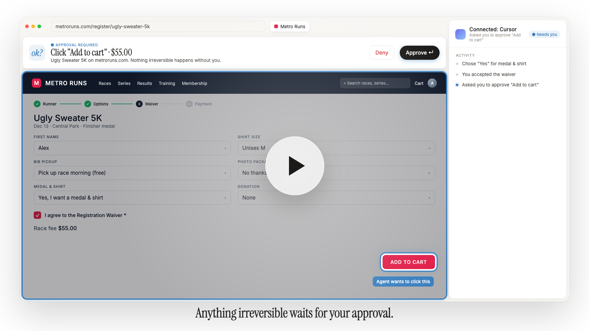

  

  A desktop browser that any MCP agent can drive. 
  Your agent does the work. You make the calls that matter.

  <b>Tandym is in beta.</b> 
  If you're interested, email <a href="mailto:hello@layeredlabs.ai">hello@layeredlabs.ai</a>.

 

  
   
  Watch the film (37 seconds)

 

## How it works

**1. Log in once.** Sign into your sites in Tandym. Sessions stay on your Mac.

**2. Connect your agent.** The welcome tour gives you one command for Claude Code, Codex, Cursor, or any MCP client.

**3. Ask.** Your agent browses, fills forms and gathers what you asked for. When it needs you, the window glows and asks. Payments, submissions and legal agreements always wait for your approval.

 

## Private by design

- **Local.** Tandym and your agent talk over a connection only your Mac can reach.
- **Your passwords stay yours.** Anything you type during a handoff is hidden from your agent.
- **Nothing irreversible without you.** Approvals are enforced by the app, not left to the model.

 

This repository hosts Tandym's releases.

